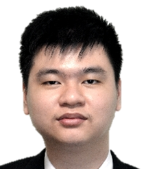

<frontmatter>
  title: "SE-EDU project Team"
  pageNav: 2
</frontmatter>



<h1 class="display-4">SE-EDU project team</h1>

We are a team based in the [School of Computing, National University of Singapore](http://www.comp.nus.edu.sg).

<box>

Note that the following sub-projects (and sister projects) manage their own list of contributors:
* https://se-education.org/learningresources/
* https://markbind.org/about.html
* https://reposense.github.io/RepoSense/about.html
* https://teammatesv4.appspot.com/about.jsp
</box>

<!-- ==================================================================================================== -->

## {{ thumbnail(":fas-users:") }} Current team

#### [Damith C. Rajapakse](http://www.comp.nus.edu.sg/~damithch)

**Role**: Project Advisor

-----------------------------------------------------------------------------------------------------

#### [LIM WEI QUAN, ERNEST](https://github.com/ernestlim8)

**Role**: Contributor [2021 Jan - ]

-----------------------------------------------------------------------------------------------------

#### [Lim Jin Hao](https://github.com/JinHao-L)

**Role**: Contributor [2021 Jan - ]

-----------------------------------------------------------------------------------------------------
#### [JOEL HO ENG KIAT](https://github.com/JoelHo)

**Role**: Contributor [2021 Aug - ]

-----------------------------------------------------------------------------------------------------

#### [KINGSLEY KUAN JUN HAO](https://github.com/kingsleykuan)

**Role**: Contributor [2021 Aug - ]

-----------------------------------------------------------------------------------------------------

#### [KOU YONG KANG](https://github.com/kouyk)

**Role**: Contributor [2021 Aug - ]

<!-- ==================================================================================================== -->

## {{ thumbnail(":fas-users:") }} Past members

-----------------------------------------------------------------------------------------------------

#### [Wang Chao](https://github.com/fzdy1914)

**Role**: Mentor [2020 Jan - 2021 Aug] 
Committer [2019 Jan - 2019 Dec]

-----------------------------------------------------------------------------------------------------

#### [Paul Tan Han Kiat](https://github.com/pyokagan)

**Role**: Mentor [2018 Jan - 2020 Dec] 
Area Lead for Code Quality [2017 Aug - 2017 Dec] 
Committer [2016 Dec - 2017 Jul]

-----------------------------------------------------------------------------------------------------

#### [Jeffry Lum](https://github.com/j-lum)

**Role**: Project Lead [2020 May - 2020 Dec] 
Committer [2019 May - 2020 Apr]

-----------------------------------------------------------------------------------------------------

#### [Lin Sin Jie](https://github.com/fzdy1914)

**Role**: Committer [2019 Jan - 2020 May]

-----------------------------------------------------------------------------------------------------

#### [Tan Wang Leng](https://github.com/yamgent)

**Role**: Mentor [2018 Apr - 2019 Dec] 
Project Lead [2017 Aug - 2018 Apr] 
Committer [2017 Jan - 2017 Aug] 
Contributor [2016 Dec - 2017 Jan]

-----------------------------------------------------------------------------------------------------

#### [Yong Zhi Yuan](https://github.com/Zhiyuan-Amos)

Project Lead: [2018 Apr - 2019 Dec] 
Area Lead for Logic [2017 Aug - 2018 - Apr] 
Committer [2017 May - 2017 Aug] 
Contributor [2016 Dec - 2017 Apr]

-----------------------------------------------------------------------------------------------------

#### [Eugene Peh](https://github.com/eugenepeh)

**Role**: Mentor [2018 Jan - 2019 Dec] 
Committer [2017 Aug - 2017 Dec] 
Contributor [2017 Feb - 2017 Jul]

-----------------------------------------------------------------------------------------------------

#### [Koh Lewis](https://github.com/Rinder5)

Committer: [2018 Mar - 2018 Dec] 
Contributor: [2018 Jan - 2018 Feb]

-----------------------------------------------------------------------------------------------------

#### [Tan Jun An](https://github.com/yamidark)

Committer: [2018 Mar - 2018 Dec] 
Contributor: [2018 Jan - 2018 Feb]

-----------------------------------------------------------------------------------------------------

#### [Vivek Lakshmanan](https://github.com/vivekscl)

Committer: [2018 Mar - 2018 Dec] 
Contributor: [2018 Jan - 2018 Feb]

-----------------------------------------------------------------------------------------------------

#### [Chua Ka Yi Ong](https://github.com/kychua)

Committer [2017 Jan - 2017 May] 
Contributor [2016 Dec - 2017 Jan]

-----------------------------------------------------------------------------------------------------

#### [Goh Yi Da Jeremy](https://github.com/MightyCupcakes)

Committer [2017 Jan - 2017 Apr] 
Contributor [2016 Dec - 2017 Jan]

-----------------------------------------------------------------------------------------------------

#### [Huang Chao](https://github.com/chao1995)

Project Mentor [2017 Arp - 2017 Dec] 
Committer [2017 Jan - 2017 Apr] 
Contributor [2016 Dec - 2017 Jan]

-----------------------------------------------------------------------------------------------------

#### [Joshua Lee](https://github.com/lejolly)

Area Lead for: UI [2016 Aug - 2017 May]

-----------------------------------------------------------------------------------------------------

#### [Leow Yijin](https://github.com/yijinl)

Area Lead for: Model [2016 May - 2017 May] 
Main developer for the first version of AddressBook-Level1

-----------------------------------------------------------------------------------------------------

#### [Lim Miao Ling](https://github.com/limmlingg)

Committer [2017 May - 2017 Aug]

-----------------------------------------------------------------------------------------------------

#### [Martin Choo](https://github.com/m133225)

Area Lead for: Dev Ops [2016 May - 2017 May]

-----------------------------------------------------------------------------------------------------

#### [Pierce Anderson Fu](https://github.com/PierceAndy)

Committer [2017 Jan - 2017 Apr] 
Contributor [2016 Dec - 2017 Jan]

-----------------------------------------------------------------------------------------------------

#### [Thien Nguyen](https://github.com/ndt93)

Area Lead for: Threading [2016 Aug - 2017 May]

-----------------------------------------------------------------------------------------------------

#### [You Liang](https://github.com/yl-coder)

Area Lead for: UI [2016 May - 2017 May]

#### [Sebastian Quek](https://github.com/issues?utf8=✓&q=repo%3Ase-edu%2Fcollate+involves%3Asebastianquek)

Wrote the initial version of the now-defunct [Collate tool](https://se-edu.github.io/collate) [2015 Jun - 2015 Sep]

<!-- ==================================================================================================== -->

## {{ thumbnail(":fas-users:") }} Past contributors

* [Akshay Narayan](https://github.com/okkhoy)
* [Apoorva](https://github.com/apoorva17)
* [Brandon Yeo](https://github.com/brandonyeoxg)
* [CHANG RUI FENG](https://github.com/RuiFengg)
* [Chia Wei Kang](https://github.com/weikangchia)
* [Clarence Chee](https://github.com/cheec)
* [Derek](https://github.com/500poundbear)
* [Desmond Ang](https://github.com/KnewYouWereTrouble)
* [Dickson Tan](https://github.com/Neurrone)
* [Edmund Mok](https://github.com/edmundmok)
* [Gerald](https://github.com/madsonic)
* [Gerald Ng](https://github.com/madsonic)
* [Herbert Ilhan Tanujaya](https://github.com/donjar)
* [Jeffry Hartanto](https://github.com/jeffryhartanto)
* [Joanne Ong](https://github.com/joanneong)
* [Joel Foo](https://github.com/jaeoheeail)
* [Kenneth Lu](https://github.com/luyangkenneth)
* [Lee De Zhang](https://github.com/dezhanglee)
* [Lee Jia Yee](https://github.com/jia1)
* [Li Xiao Wei](https://github.com/LiXiaoooowei)
* [Lim Shun Xian](https://github.com/Crsytral)
* [LOW SIANG ERN](https://github.com/siangernlow)
* [Louie Tan](https://github.com/louietyj)
* [LUM JIAN YANG, SEAN](https://github.com/seanjyjy)
* [Nicholas Chua](https://github.com/nicholaschuayunzhi)
* [Sam Yong](https://github.com/mauris)
* [Shradheya Thakre](https://github.com/tshradheya)
* [Song Zhiwen](https://github.com/zzzzwen)
* [TAN YU LI, JAMES](https://github.com/iamjamestan)
* [Thenaesh Elango](https://github.com/thenaesh)
* [Wang Riwu](https://github.com/riwu)
* [Yong Lin Han](https://github.com/linhany)
* [Zhang Yi Jiang](https://github.com/ZhangYiJiang)
* [Zi Yang](https://github.com/VeryLazyBoy)

