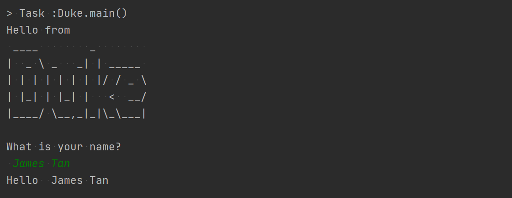

<frontmatter>
  title: "Project Templates"
  pageNav: 2
</frontmatter>



<h1 class="display-4">Project templates</h1>

These are project templates that students can use as the starting point of an SE project or as case studies.

<!-- ==================================================================================================== -->

## {{ thumbnail(":fas-box-open:") }} AddressBook Level 3 (AB3)

* **This is a project template for a brownfield Java project.**
* It simulates an ongoing software project for a desktop application (called _AddressBook_) used for managing contact details.
  * It is **written in OOP fashion**. It provides a **reasonably well-written** code base **bigger** (around 6 KLoC) than what students usually write in beginner-level SE modules, without being overwhelmingly big.
  * It comes with a **reasonable level of user and developer documentation**.
* It is named `AddressBook Level 3` (`AB3` for short) because it was initially created as a part of a series of `AddressBook` projects ([`Level 1`](https://github.com/se-edu/addressbook-level1), [`Level 2`](https://github.com/se-edu/addressbook-level2), [`Level 3`](https://github.com/se-edu/addressbook-level3), [`Level 4`](https://github.com/se-edu/addressbook-level4)).
* The project template is ==available at https://github.com/se-edu/addressbook-level3==
* Some example projects that used AB3 as the starting point are given below. More can be found [here](https://nus-cs2103-ay1920s1.github.io/website/admin/projectList.html)

<tabs>
  <tab header="Example 1">

  </tab>
  <tab header="Example 2">

  </tab>
  <tab header="Example 3">

  </tab>
</tabs>

 

<!-- ==================================================================================================== -->

## {{ thumbnail(":fas-box-open:") }} Duke

* **This is a project template for a greenfield Java project.**
* It is almost empty by default but additional configurations (e.g., Gradle, CI, JUnit, Jekyll, etc.) are available in separate branches.
* It's named after the Java mascot _Duke_. Given below are instructions on how to use it.
* The project template is ==available at https://github.com/se-edu/duke==

<!-- ==================================================================================================== -->

## {{ thumbnail(":fas-box-open:") }} Other OSS projects

For those interested in contributing to a real project (rather than build on a project template), check out the OSS projects listed in the [Tools page](tools.html). As those tools are meant for SE (hence, relatable) and were built by SE students (hence, not too big/complex), **contributing to them is a very good way for SE students to hone their SE skills**.

