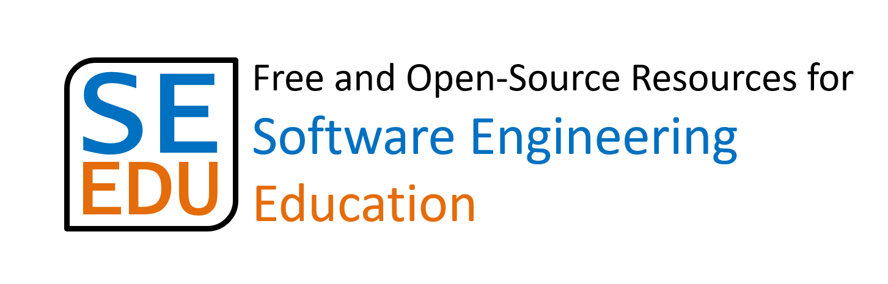

<frontmatter>
  title: "SE-EDU: Free Resources for Software Engineering Education"
  layout: "landing.md"
</frontmatter>



<header>

  

**SE-EDU is a collection of <tooltip content="Free and Open Source">FOSS</tooltip> resources for Software Engineering (SE) educators and students.**

  

</header>

# {{ thumbnail(":fas-home:") }} Resources we offer

* [**Project templates**](docs/templates.html) for students to use in school projects, both greenfield and brownfield.
* [**Learning resources**](docs/resources.html) for SE students e.g., online textbooks, tutorials, coding standards, etc.
* [**Tools**](docs/tools.html) to help educators, SE educators in particular.

# {{ thumbnail(":fas-users:") }} Our team

Our **project team** and the **list of contributors** are [here](docs/team.html).

# {{ thumbnail(":fas-code-branch:") }} Contributing to SE-EDU

We welcome code/content contributions and suggestions from students, instructors, and developers.

* **Bug reports, Suggestions** : If you noticed bugs or have suggestions on how to improve,
Post in our [main issue tracker](https://github.com/se-edu/main/issues) or in the issue tracker of the respective repo.
* **Contributing code**: PRs welcome. Refer to the documentation of each project to find more details.

# {{ thumbnail(":fas-heart:") }} Acknowledgements

* [**GitHub**](https://www.github.com/): for the education license, and the other goodies sent to students every semester.
* [**JetBrains**](https://www.jetbrains.com/): for the education licenses for their Intellij IDE suite.
* [**Netlify**](https://www.netlify.com), for providing deploy previews for some of SE-EDU projects.

# {{ thumbnail(":fas-envelope:") }} Contact us

To get in touch with us, post an issue [here](https://github.com/se-edu/main/issues) or email us at `seer [at] comp.nus.edu.sg`

